# Online Web Portal for Green Metrics Calculations and Analysis

##Overview
The Green Metrics Calculator and Analyzer is a Flask-based web application designed to simplify green metrics calculations for chemical processes. It provides multi-component reaction analysis, graphical representation, and PDF report generation.

##Features
- Multi-component reaction analysis
- Automated calculation of key green metrics:
  - Atom Economy
  - Reaction Mass Efficiency
  - Process Mass Intensity
  - E-Factor
- PDF report generation using FPDF and ReportLab
- Graphical data visualization using Matplotlib
- MySQL database integration
- Responsive user interface using HTML, CSS, Bootstrap

##Tech Stack
- Backend: Python (Flask)
- Frontend: HTML, CSS, Bootstrap
- Database: MySQL
- Libraries:
  - flask, flask-mysql-connector
  - matplotlib
  - fpdf, reportlab
  - sympy
  - pymysql

##Installation and Setup
Step 1: Clone the Repository
git clone https://github.com/Pradnya0702/GreenMetrics.git
cd GreenMetrics

Step 2: Create Virtual Environment and Activate
python -m venv env
env\Scripts\activate   # For Windows

Step 3: Install Dependencies
pip install -r requirements.txt

Step 4: Configure Database
- Create a MySQL database named green_metrics
- Update credentials in green_metrics2.py:
app.config['MYSQL_USER'] = 'root'
app.config['MYSQL_PASSWORD'] = 'your_password'
app.config['MYSQL_DATABASE'] = 'green_metrics'

Step 5: Run the Flask Application
python green_metrics2.py
Open in browser:
http://127.0.0.1:5000

## Screenshots

Home Page
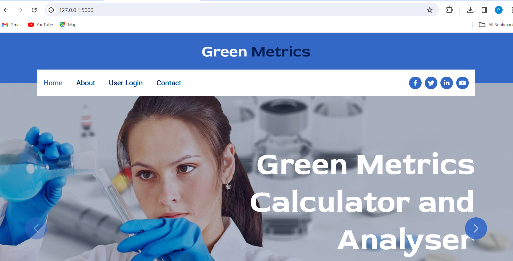

Login Page

Sign Up Page
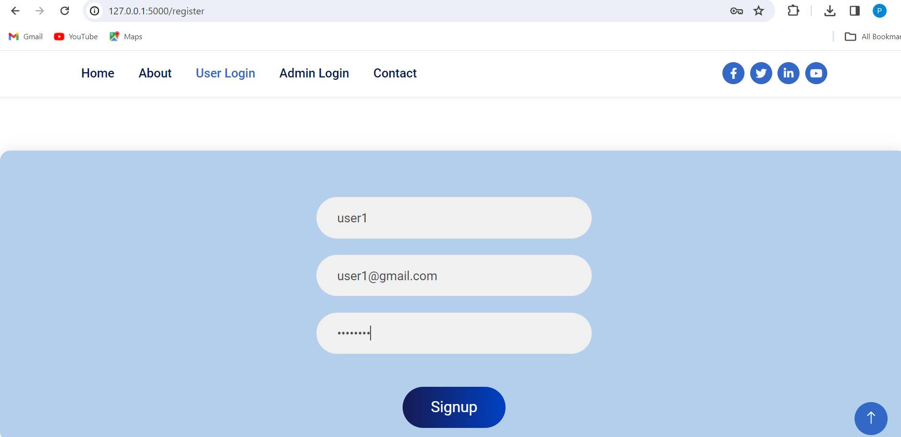

Input Form for Calculations
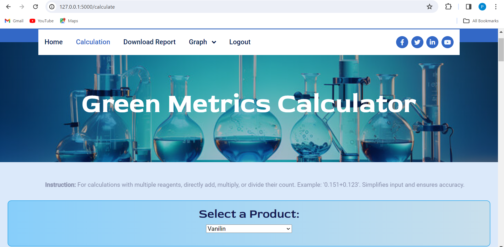
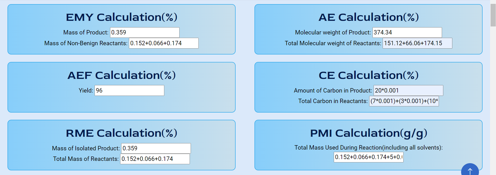

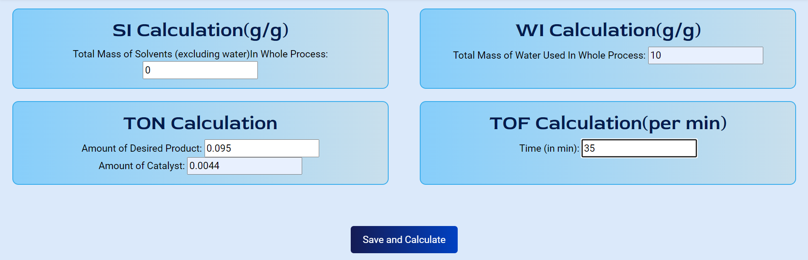

Green Metrics Output Table
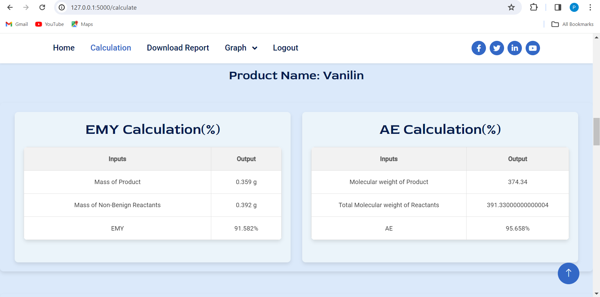
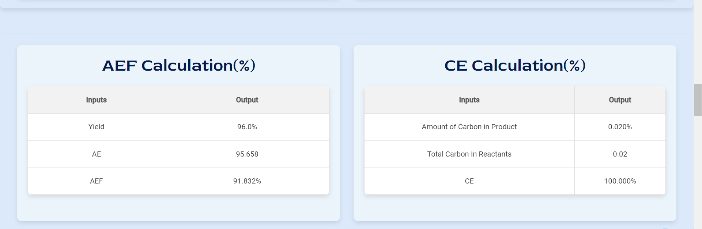
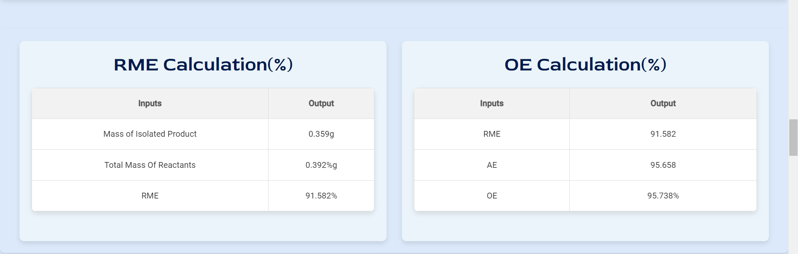
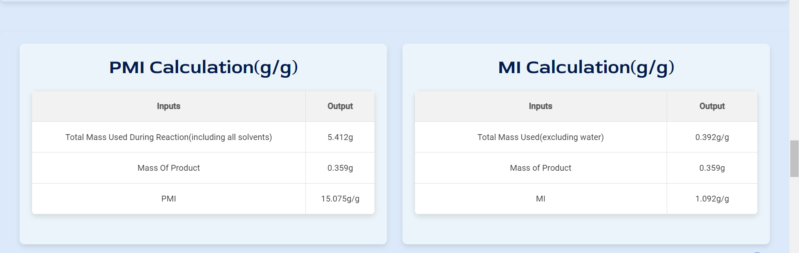
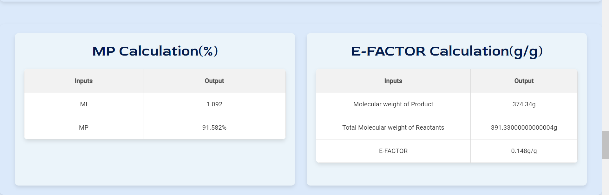
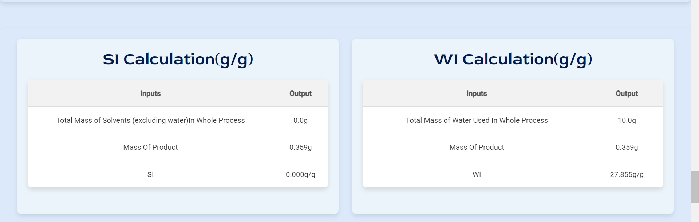
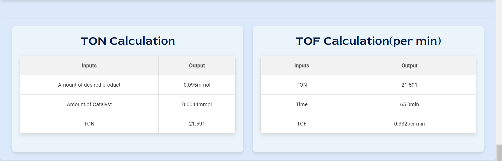

Report Generation Page
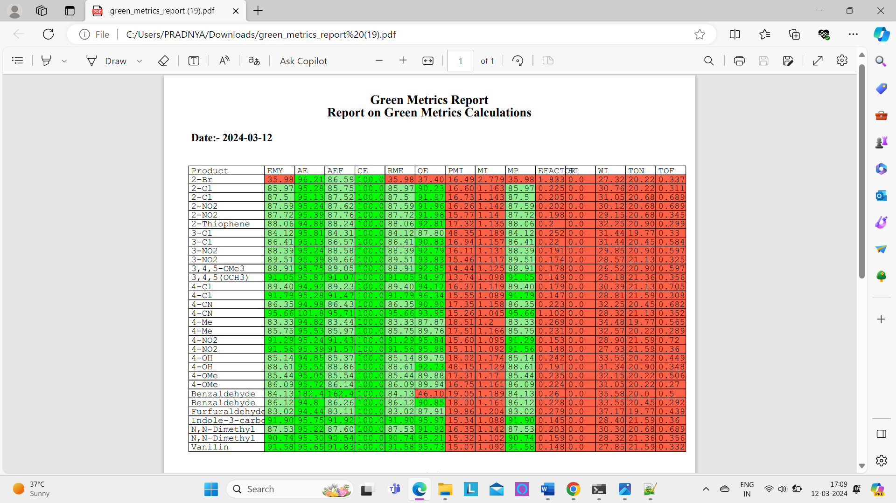
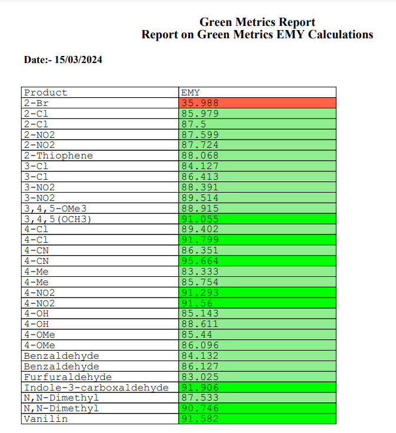

Graphical Analysis
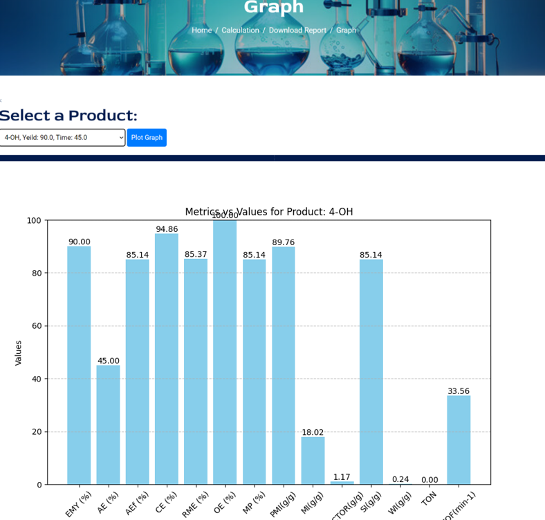
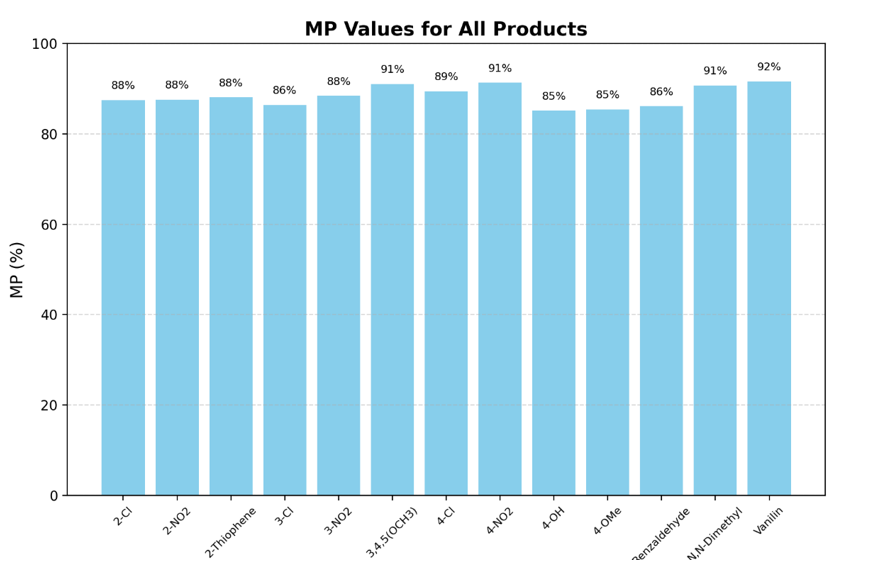

##How It Works
1. User registers or logs in
2. Inputs reaction details
3. Application calculates:
   - Atom Economy
   - Reaction Mass Efficiency
   - Process Mass Intensity
   - E-Factor (like this total 14 calculations)
4. Displays results and graphs
5. Allows PDF report download

##Database Details
- Database Name: green_metrics
- Create necessary tables manually or on first run
- Update connection settings in green_metrics2.py

#3License
This project is licensed under the MIT License.
